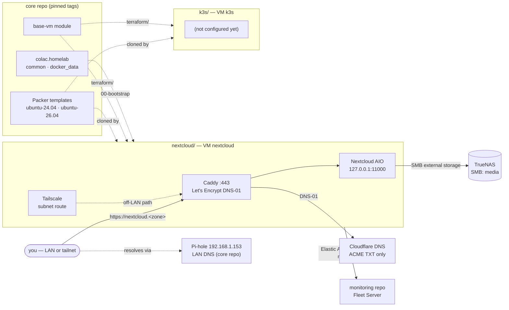

# Homelab Proxmox — Workloads

The **application layer** of the homelab: the VMs that do the actual work,
one folder per app. Today that is Nextcloud (live) and k3s (a recipe only —
its VM is not deployed).

One of three repos, each owning one layer:

| Repo | Layer | Owns |
|---|---|---|
| [homelab-proxmox](https://github.com/colac/homelab-proxmox) | **core** | Packer templates, the `base-vm` Terraform module, the `colac.homelab` Ansible collection, homelab-wide architecture |
| [homelab-proxmox-monitoring](https://github.com/colac/homelab-proxmox-monitoring) | **monitoring** | The monitoring VM, the Elastic Stack, agent enrollment on every host — this repo's VMs included |
| **homelab-proxmox-workloads** (this) | **workloads** | The apps |

The homelab-wide picture — how the layers fit, what each publishes and
consumes — is in the core repo's
[docs/ARCHITECTURE.md](https://github.com/colac/homelab-proxmox/blob/main/docs/ARCHITECTURE.md).

## Apps

| App | Folder | What it is | Status |
|---|---|---|---|
| **Nextcloud** | [nextcloud/](nextcloud/README.md) | AIO behind Caddy (Let's Encrypt via Cloudflare DNS-01), TrueNAS SMB storage, Tailscale subnet route for off-LAN reach | Live — [runbook](nextcloud/README.md) |
| **k3s** | [k3s/](k3s/README.md) | Single-node Kubernetes VM | Not deployed — Terraform recipe only |

Each app folder is self-contained, so working on one never needs the other's
context or credentials:

```text
<app>/
  README.md          the app's runbook
  AGENTS.md          the app's decisions for AI agents (+ CLAUDE.md: @AGENTS.md)
  secrets.yaml       the app's own SOPS file — Ansible reads it, Terraform never does
  terraform/         one TFC workspace, base-vm from core at a pinned tag
  ansible/           ansible.cfg, inventory, playbooks, roles, collections
```

## Architecture



### What this repo consumes, and what consumes it

| Contract | Direction | Where it is pinned |
|---|---|---|
| Templates `ubuntu-24.04-template` / `ubuntu-26.04-template` | core → here | each `<app>/terraform/variables.tf` `template_name` |
| `base-vm` module | core → here | each `<app>/terraform/main.tf` `?ref=v2.0.1` |
| `colac.homelab` collection | core → here | each `<app>/ansible/requirements.yml` `version: v2.0.1` |
| VM addresses, as agent targets | here → monitoring | monitoring's `ansible/inventory/hosts.yml` |
| Nextcloud serverinfo token (minted on the VM) | here → monitoring | monitoring's `secrets.yaml` |
| DNS: `nextcloud.<zone>` → the VM | here → core | `pihole_local_records` in core's [`dns/`](https://github.com/colac/homelab-proxmox/blob/main/dns/README.md) — a PR to core |

## Quick start

```bash
mise trust && mise install            # pinned tools (Terraform, sops, Python, …)
mise run setup                        # venv deps, each app's collections, hooks
mise run secrets:edit                 # infra: Proxmox + TFC tokens (root secrets.yaml)
mise run secrets:edit nextcloud       # the app's own secrets
mise run secrets:check                # every key present? (names only, never values)

mise run tf nextcloud plan            # any terraform command, per app
mise run play nextcloud playbooks/site.yml --check --diff
```

`mise tasks` lists everything. The app comes first; the rest goes straight to
the tool with its quoting intact.

## Secrets

**Split by consumer, decrypted per command, never into your shell.**

| File | Holds | Decrypted for | Profile |
|---|---|---|---|
| `secrets.yaml` (root) | Proxmox endpoint, Terraform Proxmox token, TFC token | `mise run tf <app> …` | `terraform` → `TF_VAR_pm_api_*`, `TF_VAR_pm_tls_insecure`, `TF_TOKEN_app_terraform_io` |
| `nextcloud/secrets.yaml` | Domain, ACME email, Cloudflare token, TrueNAS SMB user/password, Nextcloud users, Tailscale key | `mise run play nextcloud …` | `nextcloud` → `NEXTCLOUD_DOMAIN`, `ACME_EMAIL`, `CLOUDFLARE_DNS_API_TOKEN`, `NEXTCLOUD_NAS_*`, `NEXTCLOUD_USERS_JSON`, `TAILSCALE_AUTHKEY` |

Each file is SOPS-encrypted with age and committed as ciphertext
(`.gitleaks.toml` allowlists them; `.gitignore` deliberately does not list
them). The matching `*.example` files are the readable key references.
`.mise/sops-exec` is the only thing that decrypts them, and each profile
exports only what its tool reads — so a Terraform run never holds an app
password, an Ansible run never holds the Proxmox token, and a new app gets its
own file and profile rather than widening an existing one.

How to issue and rotate every one of these: core's
[CREDENTIALS.md](https://github.com/colac/homelab-proxmox/blob/main/docs/CREDENTIALS.md).

What stays out of git entirely: the age private key
(`~/.config/sops/age/keys.txt`), each app's `ansible/inventory/hosts.yml`
(addresses), `*/ansible/collections/`, any `*.tfvars`, and `mise.local.toml`.

### Adding an app

1. `mkdir -p <app>/terraform` — copy `k3s/terraform`, change the workspace
   name in `versions.tf` and create it in TFC (Local execution).
2. When it gains configuration: `<app>/ansible/` (copy `nextcloud/ansible`'s
   `ansible.cfg`, `requirements.yml`, `.ansible-lint` and `00-bootstrap.yml`).
3. When it gains secrets: `<app>/secrets.yaml.example`, `sops <app>/secrets.yaml`,
   and a profile named after the app in `.mise/sops-exec`.
4. A `README.md` (runbook), an `AGENTS.md` (its deliberate decisions) and a
   `CLAUDE.md` containing just `@AGENTS.md`.
5. Add the VM to the monitoring repo's `ansible/inventory/hosts.yml` so it
   gets an Elastic Agent.

## Development

Tools, tasks, conventions and how to roll out a new core version are shared
by all three repos: core's [DEVELOPMENT.md](https://github.com/colac/homelab-proxmox/blob/main/docs/DEVELOPMENT.md).
AI agents: [AGENTS.md](AGENTS.md), plus `<app>/AGENTS.md`.
